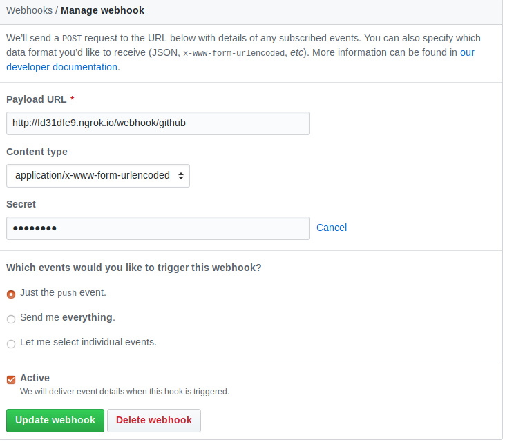

## Using lapis for git webhooks


We can use lapis to listen for git webhook actions and pass the info to a gedis actor.
Gedis already have a simple actor called `webhook` in `base` package from `digitalmeX` repo.

1 - you will need to load the webhook actor into gedis server and start gedis
```python
server = j.servers.gedis.configure(host="0.0.0.0", port=8888)
server.actor_add('/sandbox/code/github/threefoldtech/digitalmeX/packages/system/base/actors/webhook.py')
server.start()
```

2 - Configure lapis to be able to connect to gedis, by editing `config.moon` in `lapis-wiki` directory

```
config = require "lapis.config"

config "development", ->
  gedis_port 8888
  gedis_host '127.0.0.1'
```

3 - configure the webhook settings. Currently we support only `github` webhooks. Other git websites support will be added in the future
 
#### Github
```
Payload URL = <YOUR_DOMAIN>/webhook/github
Content Type = application/x-www-form-urlencoded
SECRET = <YOUR_SECRET> 
```


4 - Add the github secret into lapis config `config.moon` file
```
config "development", ->
  gedis_port 8888
  gedis_host '127.0.0.1'
  github_secret 'SECRET'
```

5 - Run Lapis server and test the webhook delivery.
